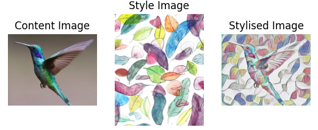

# Neural Style Transfer

## About
Neural style transfer is an optimization technique used to take two images— a content image and a style reference image (such as an artwork by a famous painter) and blend them together so the output image looks like the content image, but “painted” in the style of the style reference image.

This repository contains the neural style transfer model, built using TensorFlow and stored at `nst_model` directory. A simple demo script is available at `demo.py`. The model is deployed on the backend FastAPI server.



The frontend application was built using React, allowing the user to upload their content image and choose the style images.


## Setup for backend FastAPI (Python) server
<ol>
    <li>Install Python</li>
    <li>Install the required Python packages</li>
    <code>pip3 install -r api/requirements.txt</code>
</ol>

## Setup for frontend web application (React)

<ol>
    <li>Install NodeJS</li>
    <li>Install NPM</li>
    <li>Install dependencies</li>

    cd frontend
    npm install --from-lock-json
</ol>

## Run the backend FastAPI (Python) server
Move to the `api` directory and run the app. This should start the backend server at [http://localhost:3000](http://localhost:3000).
```
cd api
python main.py
```

## Run the frontend web application (React)
Move to the `frontend` directory and run the app.
Open [http://localhost:3000](http://localhost:3000) to view it in your browser.
```
cd api
npm start
```